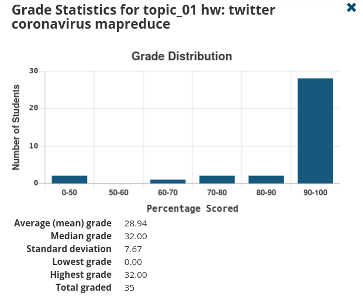
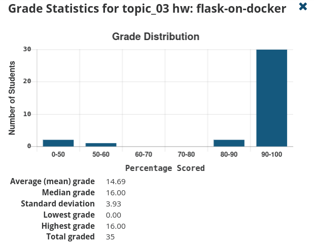
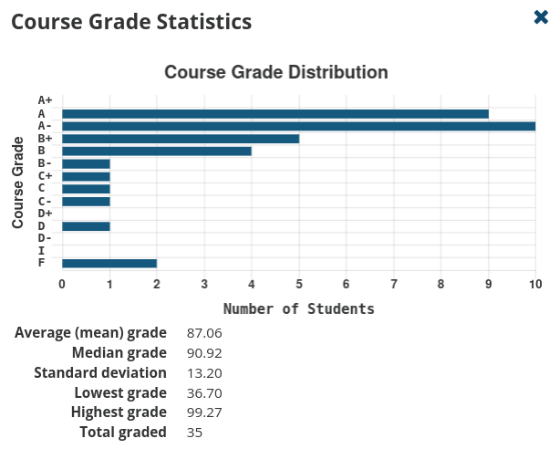

# Topic 05: SQL II

## Announcements

**Tuesday 04 Mar 2025**

1. Grades:

    twitter\_coronavirus

    

    Missed points:

    -4: mappers didn't finish running on all of the data

    -2: something weird with your plot

    -8: no line plots / alternative reduce

     

    flask-on-docker

    

    <!--
    Both assignments:

    - much emoji
    -->

     

    

1. Get a good workflow going for your assignments

    

     

    

1. Quiz Thursday on `quiz_notes_1.sql`

    4 problems

    Each worth 2 points (1 point for sqlite result, 1 point for postgres result)

    See example quizzes at `quiz_example_1*.sql` for practice

**Tuesday 04 Mar 2025**

1. SQL Extra Credit:

    <https://github.com/mikeizbicki/cmc-csci143/issues/577#issuecomment-2704525002>

1. Reminder:
    
    There will be content in pagila homeworks not covered in class.

1. How to use LLMs:

    

     

    

     

    

## Lecture Notes

What you need to know for your quiz/homework:

1. subqueries
    1. section 7 of <https://www.postgresqltutorial.com/>
    1. compared to joins (power):
        1. every join can be written as a cross join + subquery
        1. some subqueries can be written as joins
        1. a subquery cannot be written as a join if it contains an aggregate function
    1. compared to joins (general):
        1. subqueries are easier for beginners to understand than joins
        1. joins are easier for experts to understand
        1. there is no performance difference (in theory)
    1. alternative reference on subqueries vs joins: <https://learnsql.com/blog/subquery-vs-join/>

1. set operations
    1. section 5 of <https://www.postgresqltutorial.com/>
    1. most important operation is `union` vs `union all`

1. joins
    1. sections 3 of <https://www.postgresqltutorial.com/>
    1. the "standard" explanation of joins uses venn diagrams, but this is technically not correct since relations are not sets; see: <https://blog.jooq.org/2016/07/05/say-no-to-venn-diagrams-when-explaining-joins/>

       

    1. if this all seems weird/hard/confusing... that's because it is

       

We will not cover the following topics in class (but you need to know for homework):

1. arrays
    1. postgresql specific extension, not on quiz
    1. a "denormalized" method for storing join tables
        1. there's speed/memory tradeoffs between different representations which we'll talk about later
        1. for now, just focus on using arrays to get the right answer
    1. https://www.postgresqltutorial.com/postgresql-array/
    1. `unnest` is the only array function you'll want to use (for this week's homework)

1. section 6 of <https://www.postgresqltutorial.com/>
    1. syntactic sugar for complicated GROUP BY clauses
    1. good to know, but they're not "hard" concepts
    1. "less technical" technical interviews often ask about these topics

1. window functions <https://www.postgresqltutorial.com/postgresql-window-function/>
    1. later homework problems walk you through some basic usage

<!--
1. `CREATE TABLE`
    1. https://www.postgresqltutorial.com/postgresql-create-table/
    1. https://www.postgresqltutorial.com/postgresql-data-types/
    1. Examples in the tutorial use `VARCHAR`, but you shouldn't use this type in postgresql.
       Instead, you should use the `TEXT` type.
       See: https://wiki.postgresql.org/wiki/Don%27t_Do_This#Don.27t_use_varchar.28n.29_by_default

1. `INSERT` / `UPDATE` / `DELETE`
    1. 
    1. sections 9 of https://www.postgresqltutorial.com/
-->

## Lab

Posted at <https://github.com/mikeizbicki/lab-sqlite-joins>.

## Homework

See <https://gitlab.com/mikeizbicki/pagila-hw2>.
