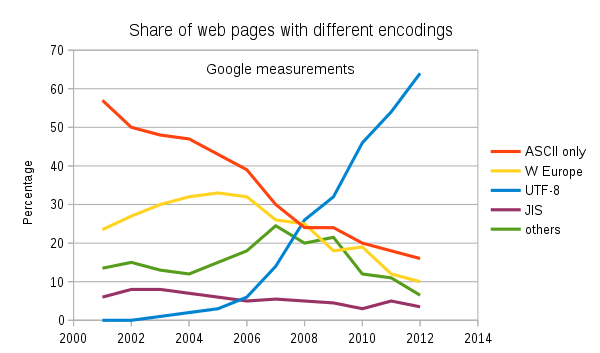

# Week 12: Unicode + more FTS

Unicode

1. IMNSHO, the #1 most important concept for any practicing data scientist/computer scientist

1. A system for representing *every* possible language using computers

   1. developed by thousands of phd-level linguists and computer scientists from around the world

   1. replaces older language/country-specific systems

      1. ASCII - English/US
      1. KOI8 - Russian/USSR

   1. also used for emoji

      

      
      

      You can find an explanation of this comic at https://www.explainxkcd.com/wiki/index.php/1813:_Vomiting_Emoji

   1. Python was among the first language with good native Unicode support,
      which helped drive its initial popularity.

   1. The split between python 2 and 3 is basically over how to handle unicode.
      
      1. Python 3 chooses what's best for pure-python developers.

      1. Pytohn 2 chooses what's best for people who combine python with other languages (especially C).
1. Key definitions:

    1. code point: a number associated with a particular character

    1. encoding: a system for converting a sequence of code points into a sequence of bytes that will actually be stored on a computer

        1. UTF8:
            1. Latin characters use 1 byte/code point
            1. Arabic/Cyrillic/Greek/Hebrew/most "western" languages use 2 bytes/code point
            1. Chinese/Indic/Japanese/Korean/Vietnamese languages use 3 bytes/code point
            1. Emoji use 4 bytes/code point
        1. UTF16:
            1. Most European and Asian languages use 2 bytes/code point for the vast majority of characters
            1. Some Asian languages require 4 bytes/code point
            1. Emoji use 4 bytes/code point
            1. Up to 33% more efficient storage for Asian languages, 50% less efficient storage for English
            1. Was originally the "default" unicode representation for Windows and Java, but UTF8 has now become the "default"
               
               

        1. using the wrong encoding is the classic problem resulting in garbled text

           

    1. font: a mapping from a code point to an image

        1. fonts are chosen by the device, and can completely change the meaning of the underlying string

        1. Apple decided to change te meaning of the gun emoji: https://blog.emojipedia.org/apple-and-the-gun-emoji/

    1. combining character: a character that modifies the preceding character

    1. normal forms: there are many ways to represent the same string in unicode, and a "normal form" is a canonical way to represent a string

        1. normal form composed (NFC): remove as many combining characters as possible

        1. normal form decomposed (NFD): use as many combining characters as possible

1. **takeaway:**
   whenever you have a string, in any programming language, you MUST know the encoding and the normalization of the string in order to use it

    1. the encoding cannot be reliably determined from just the raw bytes; the normalization form can, but it is expensive to do so

    1. anytime you get input from a user (e.g. keyboard, read from a file, load a web form):
        1. the input system *should* handle encoding issues for you, but it will not handle normalization issues
        1. you must normalize the input manually

    1. the default that "everyone" uses is UTF8 encoded NFC normalized text

1. References:

    1. [The Absolute Minimum Every Software Developer Absolutely, Positively Must Know About Unicode and Character Sets (No Excuses!)](https://www.joelonsoftware.com/2003/10/08/the-absolute-minimum-every-software-developer-absolutely-positively-must-know-about-unicode-and-character-sets-no-excuses/)

    1. NSA's security risks of Unicode: https://apps.nsa.gov/iaarchive/library/reports/unicode-security-risks.cfm

    1. Postgres unicode reference: https://www.2ndquadrant.com/en/blog/unicode-normalization-in-postgresql-13/

    1. MySQL does not handle utf8 correctly: https://adamhooper.medium.com/in-mysql-never-use-utf8-use-utf8mb4-11761243e434

Language-aware searching with `tsvector`s

1. See https://github.com/mikeizbicki/pspacy

Ngram searching

1. `pg_trgm`

    1. built-in to postgres

       documentation: https://www.postgresql.org/docs/12/pgtrgm.html

    1. provides an "operator class", which lets standard GIN/RUM indexes use trigrams as their lexemes

    1. advantages:

        1. allows "fuzzy" searches involving misspellings

        1. language agnostic

    1. disadvantages:

        1. supports only ASCII characters

        1. index scans typically much slower than when using a language-aware `tsvector`

        1. can't support advanced query features (exact string match, boolean conditionals, etc.)

1. `pg_bigm`

    1. not built-in to postgres

       project homepage: https://pgbigm.osdn.jp/index_en.html

    1. like `pg_trgm`, but creates bigrams instead of trigrams

        1. supports all unicode characters

        1. bigrams are particularly useful for Asian languages, especially Chinese

        1. otherwise, same adv/disadvantages of `pg_trgm`

1. pgroonga

    1. not built-in to postgres

       project homepage: https://pgroonga.github.io/

    1. does not provide a method for working with GIN/RUM indexes

        1. internally, it uses it's own equivalent of `tsvector`s 
            1. uses a combination of language-aware processing stemming, and n-grams of varying length depending on the script (e.g. 2 for Chinese, 5 for Latin)

        1. internally has its own index that is basically the same as a GIN index, but the index is managed by the Groonga library and not by postgres

            1. not crash safe

            1. uses lots of disk space, doesn't respect certain postgres configuration options

        1. really great Asian language support, especially Japanese

    1. pgroonga vs `pg_trgm`: https://pgroonga.github.io/reference/pgroonga-versus-textsearch-and-pg-trgm.html

    1. pgroonga vs `pg_bigm`: https://pgroonga.github.io/reference/pgroonga-versus-pg-bigm.html

**Open Research Task:**
1. What is the performance difference between pspacy and these alternative libraries?
    1. In theory, pspacy should be both faster and more accurate for more languages
    1. In practice, there's likely some language-specific bugs that need to be worked out

**My current recommendation:**
1. If your language is natively supported by postgres: use `tsvector`s
1. Otherwise, use pgroonga

## Homework

Review the `questions.pdf` file,
and attempt to understand the answers to each question.
Once you're done, enter into sakai:
> I've reviewed the answers and am prepared to answer similar questions on the final exam.
to receive full credit on the assignment.
