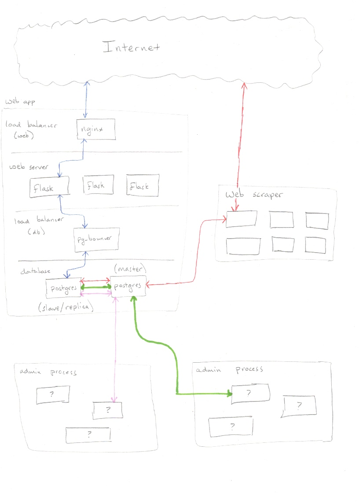

# Putting it all together: web search

Updated "Instagram architecture" diagram:



## Scaling

1. Vertical scaling: add more RAM/disk/cpu to the same machine
   
   Horizontal scaling: add more machines

   <a href=http://pudgylogic.blogspot.com/2016/01/horizontal-vs-vertical-scaling.html></a>

1. Stateless process
    1. Easy to scale to multiple machines: just change 1 line in the `docker-compose.yml`
    1. Applies to everything except postgres

1. Postgres
    1. Read only workloads
        1. OLAP = online analytics processing
        1. effectively stateless processes
        1. easy to scale horizontally
        1. search engines, data analytics, and most data science applications fall into this category
        1. just "replicate" your database many times 
            1. adjust the `docker-compose.yml` file
            1. requires some additional work to make sure all the instances get the right database info

    1. Write heavy workloads
        1. OLTP = online transactions processing
        1. difficult to scale to multiple machines
        1. how do you ensure that writes to one machine get *propogated* to the other machnines?
        1. requires extensive modifications to how the database is designed
        1. many possible ways to handle this, each with difference performance tradeoffs
           1. native postgres solutions: https://www.postgresql.org/docs/13/different-replication-solutions.html
           1. extensions: https://wiki.postgresql.org/wiki/Replication,_Clustering,_and_Connection_Pooling#Replication
               1. citus is very popular: https://www.citusdata.com/

1. Design goal
    1. Push as much work as possible into the "stateless processes" because these are easiest to scale horizontally

## Web scraping

Where to get data:

1. The [internet archive](https://archive.org/web/petabox.php)
    1. more than 50 petabytes as of 2014, data goes back into the 90s
    1. the best source of data for what the web looked like in the past
    1. average 40GB/sec (= 13PB/month) data transfer: <http://blog.archive.org/2020/05/11/thank-you-for-helping-us-increase-our-bandwidth/>
    1. the wayback machine is open source
        1. https://github.com/internetarchive/wayback
        1. lots of custom java programs
    1. 

1. The [common crawl](https://commoncrawl.org/)
    1. more than 1 petabyte, data goes back to 2008, but significantly more data for recent years
    1. standard archive for scientific research about how the web looks "now"
    1. hosted on Amazon S3
        1. standard method for storing/distributing large static files
        1. excellent record of high uptime, no data loss
        1. pricing: https://aws.amazon.com/s3/pricing/
            1. common crawl's storage fees: ($0.021/GB/month)*(10^6 GB/PB) = $21000/PB/month
            1. data transfer fees: ($0.05/GB)*(10^6 GB/PB) = $50000/PB
    1. example uses
        1. https://commoncrawl.org/the-data/examples/
        1. map discussion of congressional bills: https://github.com/awavering/CC-Bill-Tracker
        1. prevalence of RSS feeds: https://draft.li/blog/2016/03/21/rss-usage-on-the-web/

1. write a scraper manually
    1. not recommended unless you REALLY need fine-grained to control which web pages you get access to
        1. it's hard to do correctly
        1. history: Larry Page (Google co-founder) asking for coding help on a mailing list in 1996: <https://groups.google.com/g/comp.lang.java/c/aSPAJO05LIU/m/ushhUIQQ-ogJ>
    1. every domain has a robots.txt , which describes how a well-behaved spider will interact with the domain
        1. see: <https://developers.google.com/search/docs/advanced/robots/intro>
        1. if you don't obey robots.txt, you'll get banned from the website
        1. most domains favor facebook/googlebot
        1. even these major web companies make mistakes: 
            1. see: [A Facebook crawler was making 7M requests per day to my stupid website](https://news.ycombinator.com/item?id=23490367)
    1. in the US, it is legal to scrape anything that a browser can access normally
        1. see: <https://parsers.me/us-court-fully-legalized-website-scraping-and-technically-prohibited-it/>
        1. websites are free to block your scraper and not allow you to access data
        1. but if you can access it, you can do with it whatever you'd like

Crawl data stored in WARC (= Web ARChive) files

1. standard format for storing web crawl history
    1. invented by the internet archive
    1. evolved from older ARC file format
    1. official format of the library of congress: <https://www.loc.gov/preservation/digital/formats/fdd/fdd000236.shtml>
    1. basically used by everyone; if you write your own scraper, you should use the WARC format too
1. provides a complete history of the HTTP sessions
1. how HTTP works: <https://developer.mozilla.org/en-US/docs/Web/HTTP/Overview>
1. it is not enough to just store the downloaded content!!
    1. status codes: <https://en.wikipedia.org/wiki/List_of_HTTP_status_codes>
    1. where is the encoding specified?
        1. html level
           ```
           <meta charset="utf-8"/>
           ```
           or
           ```
            <meta http-equiv="Content-Type" content="text/html; charset=utf-8"/>
           ```
        1. header level: https://www.w3.org/International/articles/definitions-characters/#httpheader

           not included in the actual HTML file itself => we need to remember this as metadata

Extract information out of html

1. for our search engine, we need to extract
    1. the publication date
    1. title
    1. description
    1. text
1. semantic web
    1. google/microsoft/yahoo/yandex/w3c's schema.org: https://schema.org/docs/documents.html
    1. facebook's open graph protocol: https://ogp.me/
    1. twitter card markup: https://developer.twitter.com/en/docs/twitter-for-websites/cards/overview/markup
    1. dublin core metadata (dcterms): https://www.dublincore.org/specifications/dublin-core/dcmi-terms/
    1. json-ld: https://json-ld.org/spec/latest/json-ld/
    1. ... and most webpages implement them wrong ...
       
       all international standards for publication date say the format should be `YYYY-MM-DD`,

       but many American websites insist on using `MM-DD-YYYY`
       
       ... and many websites decide to implement their own standard ...

       e.g. BBC, FoxNews

       

1. metahtml: <https://github.com/mikeizbicki/metahtml>

**Open Research Task:**

1. How to crawl dynamic webpages?
    1. "obvious" problems
        1. Webpages behind a login (e.g. facebook pages) won't get archived
        1. Google search results won't get archived (we'll never know what results were getting returned for "coronavirus" in January 2020)
        1. Amazon doesn't get archived (dynamically change prices of items, but how can we track that?)
    1. less obvious:
        1. Korean Central News Agency (KCNA) 
            1. the main newspaper of the DPRK (North Korea)
            1. website is http://kcna.kp
            1. it uses dynamic webpages, and so google doesn't index it at all

               see: https://www.google.com/search?hl=en&q=site%3Akcna.kp%20united%20states

            1. this issue is technical and not ideological, because Google does index other newspapers hosted in the DPRK, like Pyongyang Times:

               see: https://www.google.com/search?q=site%3Apyongyangtimes.com.kp+united+states
            1. specialized search engine https://kcnawatch.org exists for searching KCNA
                1. requires a subscription payment
                1. not as advanced as google search
        1. google has no incentive to fix this issue because advertisers don't care about these webpages
            1. therefore these webpages effectively don't exist for most people
            1. structural censorship
1. Given an HTML webpage, how can we extract the "article text" from the webpage?
    1. This is a hard problem because there are millions of domains, and each domain does it differently
    1. Not even Google has a good solution to this
    1. Existing solutions "somewhat" work for English, but basically don't work for any other language
        1. not clear if this is because of lack of research, some languages are just harder, or different web standards/design patterns are used in different languages

<!--
## Homework

Videos:

1. Scaling Instagram Infrastructure

   <https://www.youtube.com/watch?v=hnpzNAPiC0E>

1. The Evolution of Reddit.com's Architecture

   <https://www.youtube.com/watch?v=nUcO7n4hek4>

1. Postgres at Pandora

    <https://www.youtube.com/watch?v=Ii_Z-dWPzqQ&list=PLN8NEqxwuywQgN4srHe7ccgOELhZsO4yM&index=38>

1. PostgreSQL at 20TB and Beyond: Analytics at a Massive Scale (AdTech use of postgres)

   <https://www.youtube.com/watch?v=BgcJnurVFag>

1. Large Databases, Lots of Servers, on Premises, in the Cloud - Get Them All! (AdTech use of postgres)

   <https://www.youtube.com/watch?v=4GB7EDxGr_c>

1. Breaking Postgres at Scale (how to configure postgres for scaling from 1GB up to many TB)

   <https://www.youtube.com/watch?v=eZhSUXxfEu0>

1. Citus (a startup bought by Microsoft): Postgres at any Scale

    <https://www.youtube.com/watch?v=kd-F0M2_F3I>

1. Data modeling, the secret sauce of building & managing a large scale data warehouse (The speaker is the Microsoft employee responsible for purchasing Citus)

    <https://www.youtube.com/watch?v=M7EWyUrw3XQ&list=PLlrxD0HtieHjSzUZYCMvqffEU5jykfPTd&index=6>

1. Lessons learned scaling our SaaS on Postgres to 8+ billion events (ConvertFlow, another adtech company)

    <https://www.youtube.com/watch?v=PzGNpaGeHE4&list=PLlrxD0HtieHjSzUZYCMvqffEU5jykfPTd&index=13>
-->

<!--
Playlists:

1. PGConf NYC 2021

    <https://www.youtube.com/playlist?list=PLiT-kUSX8USVDO_StcVoErex-l-pVvrvv>

Reading:

1. Handling Growth with Postgres:

    <https://instagram-engineering.com/handling-growth-with-postgres-5-tips-from-instagram-d5d7e7ffdfcb>

1. Sharding and IDs at Instagram

    <https://instagram-engineering.com/sharding-ids-at-instagram-1cf5a71e5a5c>

1. Scaling our Infrastructure to Multiple Datacenters

    <https://instagram-engineering.com/instagration-pt-2-scaling-our-infrastructure-to-multiple-data-centers-5745cbad7834>

1. What powers Instagram: Hundreds of Instances, Dozens of Technologies

    <https://instagram-engineering.com/what-powers-instagram-hundreds-of-instances-dozens-of-technologies-adf2e22da2ad>
-->
